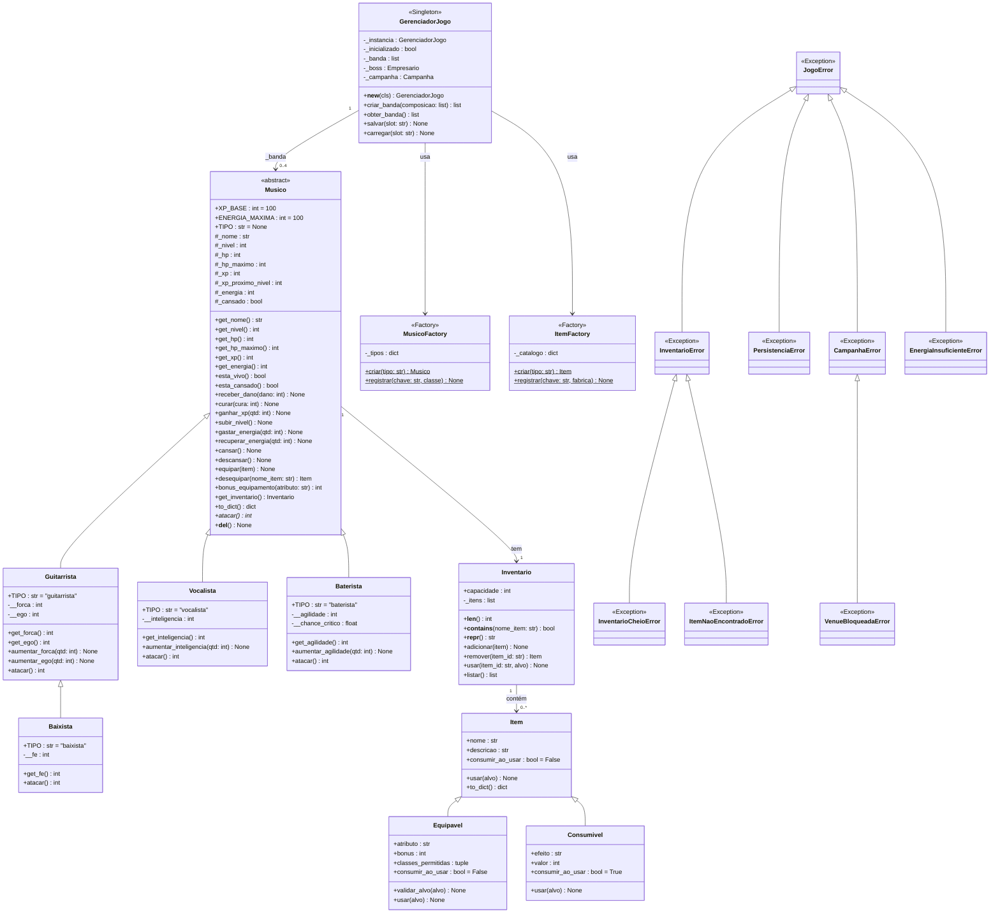

# Diagrama UML de Classes — Decibéis: a turnê contra O Empresário

> **Entregável DEL-04** — Diagrama de classes em Mermaid coerente com a implementação real em `backend/`.
> **Parte humana (D-02):** Renderizar para imagem via VS Code ("Markdown Preview Mermaid Support") ou
> em [mermaid.live](https://mermaid.live) (exportar PNG/SVG) — o agente produz apenas o texto-fonte.

---

---

## Legenda

### Estereótipos

| Estereótipo | Significado |
|-------------|-------------|
| `<<abstract>>` | Classe abstrata (ABC) — não pode ser instanciada diretamente; define a interface e o esqueleto via `@abstractmethod` |
| `<<Singleton>>` | Única instância global — controlada por `__new__` com `_instancia` de classe |
| `<<Factory>>` | Factory Method — centraliza a criação de objetos por tipo-string; extensível via `registrar()` |
| `<<Exception>>` | Classe de exceção do domínio — derivada de `JogoError` (raiz da hierarquia) |

### Três hierarquias principais

1. **Musico** — hierarquia de personagens: `Musico` (ABC) → `Guitarrista`, `Vocalista`, `Baterista`;
   `Guitarrista` → `Baixista` (Baixista herda de Guitarrista, pois compartilha o atributo de força).

2. **Item** — hierarquia de itens: `Item` (base) → `Equipavel` (ocupa slot, bônus de atributo)
   e `Consumivel` (efeito único, destruído ao usar).

3. **JogoError** — hierarquia de exceções: `JogoError` é a raiz; ramos cobrem
   `InventarioError`, `PersistenciaError`, `CampanhaError` e seus subtipos específicos.
   Permite capturar erros no nível certo (`except JogoError` para tudo,
   `except InventarioError` só para o inventário).
